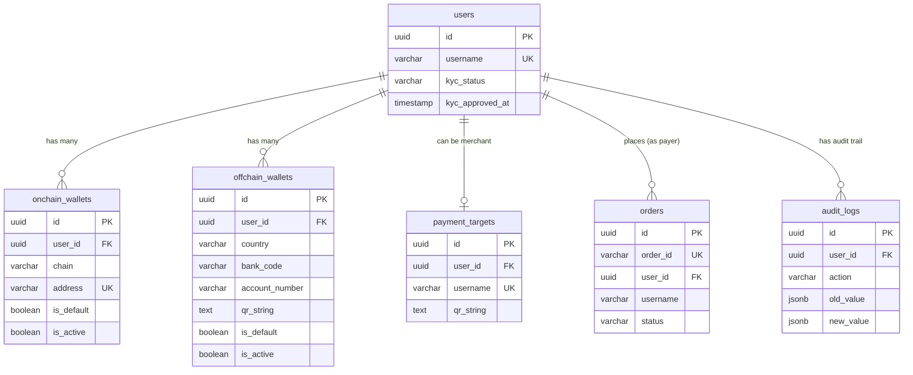

# Identity – Wallet Management Requirements

## 0.  Bối cảnh & Mục tiêu

**Sản phẩm**:  Payment Infrastructure

**Chain sử dụng**: SUI (mở rộng sau)

**Mục tiêu**: 

- Xây dựng lớp identity theo `userID`
- Cho phép khôi phục identity bằng wallet
- Quản lý nhiều wallet + nhiều ngân hàng trên cùng một user
- Quản lý default wallet và vòng đời wallet
- **KYC một lần cho toàn bộ identity** (wallet mới tự động kế thừa)

---

## 1. Phạm vi

### 1.1 Trong phạm vi

- `userID` và `username`
- Liên kết wallet onchain (SUI)
- Liên kết tài khoản ngân hàng offchain (VietQR, InstaPay)
- Default wallet (có thể là onchain hoặc offchain)
- Deactivate wallet
- Xoá wallet (hard delete)
- **KYC management theo userID** (KYC một lần, áp dụng cho TẤT CẢ wallets và bank accounts của user đó)

---

## 2. Kiến trúc Identity & Wallet Linking

### 2.1 Nguyên tắc thiết kế

```
users (Core Identity + KYC)
  └── user_id (Primary Key)
       ├── username (Public alias)
       ├── kyc_status ⭐ (ONE-TIME KYC)
       │
       ├── onchain_wallets (nhiều)
       │     └── user_id (Foreign Key) ⭐
       │
       └── offchain_wallets (nhiều)
             └── user_id (Foreign Key) ⭐
```

### 2.2 Wallet Linking Logic

**Cả onchain và offchain wallets đều:**

1.  Chứa `user_id` làm foreign key
2. Dùng **cùng logic linking**: 
   - Validate format
   - Check uniqueness (kiểm tra wallet này đã ai link chưa)
   - Nếu đã tồn tại → show username owner
   - Insert vào table tương ứng
   - Auto set default nếu là wallet đầu tiên
   - **Kế thừa KYC từ userID**

### 2.3 KYC Inheritance Model

```
User KYC approved (users. kyc_status = 'approved')
    ↓
All wallets (current + future) can transfer
    ├── Existing Wallet #1 ✅
    ├── Existing Wallet #2 ✅
    ├── New Wallet #3 (added later) ✅ ← Auto inherit
    └── Bank Account #1 (added later) ✅ ← Auto inherit
```

---

## 3. Nguyên tắc cốt lõi (bắt buộc)

1. **Wallet** (chain + address) là khoá mạnh nhất để restore identity
2. Nếu wallet đã tồn tại: 
   - Hiển thị "wallet đã đăng ký dưới username X"
   - Cho phép dùng luôn
   - **Không tạo user mới**
3. **userID** là lõi duy nhất của identity
4. **username** là public alias, có thể đổi
5. **Default wallet** là wallet chính của user để nhận/gửi tiền
6. **KYC gắn với userID**, không gắn với từng wallet ⭐
7. **Wallet mới tự động kế thừa KYC** từ userID ⭐

---

## 4. Use Cases

### **UC1 – Create Identity** (wallet chưa tồn tại)

**Mô tả**: Tạo `userID` mới và gắn `username` do user đặt. 

**Rule bắt buộc**: 

- `username` phải unique (global, per environment)
- `userID` immutable, không lộ ra ngoài
- UC này chỉ chạy khi restore identity thất bại
- User mới có `kyc_status = 'not_submitted'`

---

### **UC2 – Link Onchain Wallet**

**Mô tả**: Liên kết wallet onchain (SUI) vào `userID` bằng 2 cách: **Manual** hoặc **QR Scan**.

**Rule bắt buộc**:

- Mỗi wallet chỉ thuộc về một `userID` duy nhất
- Không cho relink wallet sang `userID` khác
- Link xong phải có trạng thái `active`
- **Wallet mới tự động kế thừa `kyc_status` từ user** ⭐
- Nếu user đã KYC approved → wallet mới có thể transfer ngay lập tức

#### **UC2A - Manual Input**

**Main Flow**:
1. User clicks "Add Wallet" → "Enter Manually"
2. User pastes SUI address: `0xabc123...`
3. User enters label (optional): `"My Main Wallet"`
4. System validates address format (0x prefix, 66 chars)
5. System checks uniqueness
6. If new:
   - Insert: `source_type = 'manual'`
   - Auto set `is_default = true` if first wallet
   - Inherit KYC from user
   - Return wallet + `canTransfer` flag
7. Audit log

#### **UC2B - QR Scan**

**Main Flow**:
1. User clicks "Add Wallet" → "Scan QR Code"
2. App opens camera/QR scanner
3. User scans SUI wallet QR code
4. Frontend decodes QR → extracts address
5. Frontend sends to API: `{ address: "0xdef456...", source_type: "qr_scan" }`
6. System validates & inserts (same as UC2A)
7. Return wallet + `canTransfer` flag

**QR Format**: `{"type": "sui_wallet", "address": "0xdef456..."}` hoặc simple string `0xdef456...`

---

### **UC3 – Link Offchain Wallet (Bank)**

**Mô tả**: Liên kết tài khoản ngân hàng offchain vào `userID` bằng 2 cách: **Manual** hoặc **QR Scan**.

**Rule bắt buộc**:

- Mỗi tài khoản ngân hàng chỉ thuộc về một `userID`
- Không cho dùng chung ngân hàng giữa các `userID`
- Ngân hàng inactive thì không được set default
- **Bank account mới tự động kế thừa `kyc_status` từ user** ⭐

#### **UC3A - Manual Input**

**Main Flow**:
1. User clicks "Add Bank" → "Enter Manually"
2. User fills form:
   - Country: `VN`
   - Bank: `Techcombank`
   - Account Number: `19036337179018`
   - Account Name: `NGUYEN VAN A`
3. System validates format
4. System checks uniqueness
5. If new:
   - Insert: `source_type = 'manual'`, `qr_string = null`
   - Auto set `is_default = true` if first account
   - Inherit KYC from user
   - Return bank info + `canTransfer` flag
6. Audit log

#### **UC3B - QR Scan**

**Main Flow**:
1. User clicks "Add Bank" → "Scan QR Code"
2. App opens camera
3. User scans VietQR code (from bank app or paper)
4. Frontend sends raw QR string to API
5. **Backend parses QR string**:
   - Extract `bank_code`, `account_number`, `account_name`
   - Lookup `bank_name`, determine `country`
6. System checks uniqueness
7. If new:
   - Insert: `source_type = 'qr_scan'`, save `qr_string` + `qr_parsed_data`
   - Auto set `is_default = true` if first account
   - Inherit KYC from user
   - Return parsed bank info + `canTransfer` flag
8. Audit log

**QR Format**: VietQR/InstaPay string `00020101021238530010A000000727...`

---

### **UC4 – Một userID sở hữu nhiều Account**

**Mô tả**: Một user có thể có nhiều wallet và nhiều ngân hàng. 

**Rule bắt buộc**:

- Mọi account đều phải chứa `userID`
- Không tồn tại account "mồ côi" không có `userID`
- **Tất cả accounts dùng chung một `kyc_status`** ⭐

**Example**:
```
User:  @merchant_abc (KYC approved)
  ├── SUI Wallet #1 (0xabc.. .) → can transfer ✅
  ├── SUI Wallet #2 (0xdef...) → can transfer ✅
  ├── Techcombank ****9018 → can transfer ✅
  └── VietcomBank ****7890 → can transfer ✅
```

---

### **UC5 – Chọn Default Wallet**

**Mô tả**: User chọn wallet dùng làm mặc định (có thể là onchain hoặc offchain).

**Rule bắt buộc**: 

- Tại mọi thời điểm chỉ có **1 default wallet globally** (across onchain + offchain)
- Wallet inactive không được set default
- Nếu user chỉ có 1 wallet thì wallet đó auto default

**Main Flow**:
1. User chọn wallet (onchain hoặc offchain)
2. System validate:
   - Wallet phải `is_active = true`
   - Wallet thuộc về user hiện tại
3. **System update trong transaction**:
   ```sql
   BEGIN;
     -- Unset all defaults across BOTH tables
   UPDATE onchain_wallets SET is_default = FALSE WHERE user_id = ?;
   UPDATE offchain_wallets SET is_default = FALSE WHERE user_id = ?;
   
     -- Set new default (either onchain OR offchain)
     UPDATE onchain_wallets SET is_default = TRUE WHERE id = ? AND user_id = ?;
     -- OR
     UPDATE offchain_wallets SET is_default = TRUE WHERE id = ? AND user_id = ?;
   COMMIT;
   ```

---

### **UC6 – Deactivate/Khoá tạm Wallet hoặc Ngân hàng** (SOFT LOCK)

**Mô tả**: Ngưng sử dụng account nhưng giữ lịch sử, có thể reactivate sau. 

**Rule bắt buộc**:

- Wallet bị khoá không được dùng receive/pay
- Nếu deactivate account default → phải auto chọn default mới hoặc unset
- Không xoá record khỏi DB
- Wallet khoá vẫn có thể mở lại (reactivate)
- Wallet khoá vẫn giữ khả năng restore identity
- **KYC status không bị ảnh hưởng** (vẫn có thể transfer bằng wallet khác)

**Auto Fallback Logic**:
```
User deactivates default wallet
  ↓
System finds other active wallets: 
  Priority 1: Other offchain wallets (if deactivated was offchain)
  Priority 2: Onchain wallets
  Priority 3: Other offchain wallets (if deactivated was onchain)
  ↓
IF found: 
    Auto set as new default
    Notify user:  "Default changed to [wallet name]"
ELSE:
    Unset default
    Notify user:  "Add active wallet to receive payments"
```

---

### **UC7 – Đổi Username**

**Mô tả**: User đổi tên hiển thị.

**Rule bắt buộc**:

- `username` mới phải unique (global, per environment)
- `userID` và các account không thay đổi
- **KYC status không thay đổi**
- Rate limit: 3 changes per 30 days

---

### **UC8 – Restore Identity** khi dùng lại wallet

**Mô tả**:  Connect/import wallet đã tồn tại thì khôi phục identity.

**Rule bắt buộc**:

- Restore dựa trên `(chain + walletAddress + env)`
- Phải trả về `username` đã đăng ký
- **Không tạo `userID` mới** trong mọi trường hợp
- **Return KYC status cùng với identity**

**Main Flow**:
```
User connects wallet (0xabc... 123)
  ↓
System checks: 
  SELECT w.user_id, u.username, u.kyc_status
  FROM onchain_wallets w
  JOIN users u ON w.user_id = u.id
  WHERE w.chain = 'Sui' AND w.address = ?  AND w.env = ?
  ↓
IF found:
    Return {
      user_id: uuid,
      username: 'merchant_abc',
      kyc_status: 'approved',
      canTransfer: true,
      wallets_count: 3
    }
ELSE:
    Return { found: false }
    → Trigger UC1 (Create Identity)
```

---

### **UC9 – Onboarding Entrypoint** (AUTO)

**Mô tả**:  Một entrypoint cho onboarding. 

**Rule bắt buộc**:

- Luôn gọi UC9 (Restore) trước
- Chỉ gọi UC1 (Create) khi UC9 không tìm thấy wallet
- Không cho skip bước restore

**Flow**:
```
POST /auth/onboarding
  ↓
1. Attempt Restore (UC8)
  ↓
  ┌──────────────┴──────────────┐
  ↓                             ↓
Found                       Not Found
  ↓                             ↓
Return existing identity    2. Create Identity (UC1)
+ KYC status                   ↓
                            3. Link wallet (UC2)
                               ↓
                            Return new identity
                            kyc_status: 'not_submitted'
```

---

### **UC10 – Không tạo Identity trùng**

**Mô tả**: Đảm bảo hệ thống chỉ có một identity cho mỗi wallet.

**Rule bắt buộc**:

- Nếu wallet đã tồn tại → reject mọi attempt tạo `userID` mới
- Mọi app phải dùng chung logic restore
- Show clear error message với username owner

---

### **UC11 – Xoá Wallet khỏi Tài khoản**

**Mô tả**: Người dùng xoá hẳn một wallet khỏi account và xoá record trong DB.

**Rule bắt buộc**:

- Wallet bị xoá không được là wallet mặc định
- Nếu wallet là default → bắt buộc user đổi default trước
- Chỉ cho xoá wallet thuộc `userID` hiện tại
- Xoá là **hard delete** khỏi DB (không deactivate)
- Sau khi xoá:  không còn restore identity bằng wallet đó nữa
- **KYC status không bị ảnh hưởng** (user vẫn có KYC với wallets còn lại)

---

### **UC12 – KYC theo userID** (ONE-TIME KYC)

**Mô tả**: Người dùng phải KYC thì mới được phép chuyển tiền và chỉ cần KYC một lần cho toàn bộ identity.

**Rule bắt buộc**:

- KYC gắn với `userID`, không gắn với wallet
- User chưa KYC → block mọi hành vi chuyển tiền
- User KYC rồi → tất cả wallet và ngân hàng dùng chung KYC đó
- Không cần KYC lại khi thêm wallet mới
- KYC được thực hiện thông qua **Gaian → Sumsub**

**Main Flow**:
```
User clicks "Complete KYC"
  ↓
Frontend: POST /kyc/submit
  { walletAddress, email? }
  ↓
Backend calls Gaian API:
  POST https://gaian-api/v1/kyc/link
  Body: { walletAddress, email }
  ↓
Gaian returns:
  { 
    success: true, 
    message: "KYC link generated",
    websdkUrl: "https://sumsub.com/websdk?token=..."
  }
  ↓
Backend updates DB:
UPDATE users 
  SET kyc_status = 'pending', 
      kyc_submitted_at = NOW(),
      kyc_provider = 'gaian'
WHERE id = ?
  ↓
Backend returns websdkUrl to frontend
  ↓
Frontend opens websdkUrl (Sumsub KYC form)
  ↓
User completes KYC on Sumsub
  ↓
Sumsub → Gaian → Webhook to our backend:
  POST /webhooks/kyc
  {
    userId: "uuid",
    walletAddress: "0x...",
    status: "approved",
    timestamp: "..."
  }
  ↓
Backend updates DB:
UPDATE users 
  SET kyc_status = 'approved', 
      kyc_approved_at = NOW()
WHERE id = ?
  ↓
Notify user: "KYC approved. You can now transfer funds."
```

**KYC Status Values**:
- `not_submitted`: User chưa submit KYC
- `pending`: KYC đang review trên Sumsub
- `approved`: KYC được chấp nhận
- `rejected`: KYC bị từ chối
- `expired`: KYC hết hạn (cần re-KYC)

**Gaian KYC API Integration**:
```typescript
// Call Gaian KYC API
const response = await axios.post(
  `${GAIAN_API_URL}/v1/kyc/link`,
  {
    walletAddress: user.primaryWallet,
    email: user.email // optional
  },
  {
    headers: {
      'Authorization': `Bearer ${GAIAN_API_KEY}`,
      'Content-Type': 'application/json'
    }
  }
);

// Response: { success, message, websdkUrl }
return {
  kycUrl: response.data.websdkUrl,
  status: 'pending'
};
```

---

### **UC13 – Kế thừa KYC cho Wallet mới**

**Mô tả**: Khi user đã KYC, mọi wallet hoặc ngân hàng được link sau đó tự động kế thừa trạng thái KYC. 

**Rule bắt buộc**:

- Wallet mới link không trigger KYC lại
- Trạng thái KYC luôn đọc từ `userID`
- Wallet không có KYC riêng

**Main Flow**:
```
User (KYC approved) thêm wallet mới
  ↓
POST /wallets/onchain/link
  { chain: 'Sui', address: '0xnew.. .' }
  ↓
System inserts wallet: 
  INSERT INTO onchain_wallets (user_id, chain, address, ...)
  VALUES (?, 'Sui', '0xnew...', ...)
  ↓
System reads KYC status:
  SELECT kyc_status FROM users WHERE id = ?
  → kyc_status = 'approved'
  ↓
Return response:
  {
    id: 'wallet-uuid',
    address: '0xnew...',
    canTransfer: true,  ← Inherited from user
    kycStatus: 'approved',
    message: "Wallet added.  You can use it immediately."
  }
```

**No Additional KYC Required**:
- User đã KYC → wallet mới có thể transfer ngay
- User chưa KYC → wallet mới cũng bị block transfer (inherit `canTransfer:  false`)

---

### **UC14 – Prevent KYC Bypass bằng Wallet mới**

**Mô tả**: Ngăn người dùng né KYC bằng cách thêm wallet khác.

**Rule bắt buộc**:

- Thêm wallet mới không bypass được KYC
- Nếu `userID` chưa KYC → wallet mới vẫn bị block transfer
- Logic check KYC luôn chạy trước transfer

**Attack Scenario (Prevented)**:
```
User A (chưa KYC):
  ├── SUI Wallet #1 (0xabc...) → canTransfer = false ❌
  │
  │ User attempts to bypass: 
  ├── Adds SUI Wallet #2 (0xnew...) → canTransfer = false ❌
  │   ↓
  │   System checks:  users. kyc_status = 'not_submitted'
  │   → Wallet #2 inherits same restriction
  │
  └── User is FORCED to KYC
```

**Implementation**:
```typescript
// Link wallet service
async linkWallet(userId: string, walletData: any) {
  // ...  insert wallet ... 
  
  // Read KYC status
  const user = await db.users.findUnique({
    where: { id: userId },
    select: { kyc_status: true }
  });
  
  return {
    ... walletData,
    canTransfer: user.kyc_status === 'approved',
    kycStatus: user. kyc_status,
    message: user.kyc_status === 'approved' 
      ? 'Wallet added successfully'
      : 'Wallet added.  Complete KYC to enable transfers.'
  };
}
```

---

### **UC15 - Scan Bank QR to Identify Recipient**

**Mô tả**: Khi user scan QR ngân hàng để chuyển tiền, hệ thống kiểm tra xem tài khoản ngân hàng đó đã đăng ký trong hệ thống chưa và hiển thị username nếu có.

**Rule bắt buộc**:

- Parse VietQR/InstaPay từ QR code
- Lookup bank account trong `offchain_wallets` table
- Nếu tìm thấy → hiển thị username + bank info + option "Save Contact"
- Nếu không tìm thấy → chỉ hiển thị bank info từ QR
- Lưu history "Chuyển gần đây" cho mỗi recipient

**Main Flow - Registered Account**:
```
User scans Bank QR code
  |
Frontend/Backend parse QR string
  |
Extract: country, bank_code, account_number, account_name
  |
Backend checks:
  SELECT 
    w.id, w.account_name, w.bank_name,
    u.username, u.display_name, u.avatar_url
  FROM offchain_wallets w
  JOIN users u ON w.user_id = u.id
  WHERE w.country = ? 
    AND w.bank_code = ? 
    AND w.account_number = ?
    AND w.is_active = TRUE
  |
IF FOUND (registered user):
  Response {
    registered: true,
    username: "@merchant_abc",
    displayName: "Nguyen Van A",
    avatarUrl: "https://...",
    bankInfo: {
      bankName: "Vietcombank",
      accountNumber: "1234567890",
      accountName: "NGUYEN VAN A"
    },
    canSaveContact: true
  }
  |
Frontend displays:
  - Username + Avatar (prominent)
  - Bank info
  - Button "Save to Contacts"
  - Button "Transfer"
```

**Alternative Flow - Unregistered Account**:
```
Same scan + parse
  |
Backend checks offchain_wallets
  |
IF NOT FOUND (unregistered):
  Response {
    registered: false,
    bankInfo: {
      bankName: "Vietcombank",
      accountNumber: "1234567890",
      accountName: "NGUYEN VAN B"  // from QR only
    },
    canSaveContact: false
  }
  |
Frontend displays:
  - Bank info only (no username)
  - Button "Transfer"
```

**Save Contact Feature**:
```
User clicks "Save to Contacts"
  |
POST /contacts/save
  {
    recipientUsername: "@merchant_abc",
    bankWalletId: "uuid",
    label: "Coffee Shop" // optional
  }
  |
System creates contact record
  |
Contact appears in:
  - "Recent Transfers"
  - "Saved Contacts"
  - Transfer screen autocomplete
```

**Database - contacts table** (new):
```sql
CREATE TABLE contacts (
    id                  UUID PRIMARY KEY DEFAULT gen_random_uuid(),
    user_id             UUID NOT NULL REFERENCES users(id) ON DELETE CASCADE,
    recipient_username  VARCHAR(255) NOT NULL,
    recipient_user_id   UUID REFERENCES users(id) ON DELETE CASCADE,
    bank_wallet_id      UUID REFERENCES offchain_wallets(id),
    label               VARCHAR(100),
    last_transfer_at    TIMESTAMP,
    transfer_count      INTEGER DEFAULT 0,
    created_at          TIMESTAMP DEFAULT NOW(),
    
    CONSTRAINT unique_user_contact UNIQUE(user_id, recipient_username)
);

CREATE INDEX idx_contacts_user_id ON contacts(user_id);
CREATE INDEX idx_contacts_recipient ON contacts(recipient_user_id);
```

**Recent Transfers Query**:
```sql
-- Get recent transfer recipients
SELECT 
    c.recipient_username,
    u.display_name,
    u.avatar_url,
    w.bank_name,
    w.account_number,
    c.last_transfer_at,
    c.transfer_count
FROM contacts c
JOIN users u ON c.recipient_user_id = u.id
LEFT JOIN offchain_wallets w ON c.bank_wallet_id = w.id
WHERE c.user_id = ?
ORDER BY c.last_transfer_at DESC
LIMIT 10;
```

---

## 5. Functional Requirements

### FR-1:  Quản lý Identity

- **FR-1.1**: Tạo identity mới khi wallet chưa tồn tại (UC1)
- **FR-1.2**: Khôi phục identity bằng wallet (UC8)
- **FR-1.3**: Đổi username (UC7)
- **FR-1.4**: Onboarding entrypoint tự động restore trước khi tạo mới (UC9)

### FR-2: Quản lý Wallet

- **FR-2.1**: Liên kết wallet - manual input (UC2A)
- **FR-2.2**: Liên kết wallet - QR scan (UC2B)
- **FR-2.3**: Chọn default wallet - onchain hoặc offchain (UC5)
- **FR-2.4**: Deactivate wallet - soft lock (UC6)
- **FR-2.5**: Reactivate wallet - mở lại wallet bị khoá (UC6)
- **FR-2.6**: Xoá wallet - hard delete (UC11)
- **FR-2.7**: Liệt kê tất cả wallets của user với KYC status (UC4)
- **FR-2.8**: Kiểm tra wallet đã tồn tại hay chưa (UC10)

### FR-3: Quản lý Ngân hàng

- **FR-3.1**: Liên kết bank - manual input (UC3A)
- **FR-3.2**: Liên kết bank - QR scan with VietQR parse (UC3B)
- **FR-3.3**: Deactivate ngân hàng (UC6)
- **FR-3.4**: Reactivate ngân hàng
- **FR-3.5**: Xoá ngân hàng (hard delete)
- **FR-3.6**: Chọn default bank account
- **FR-3.7**: Liệt kê tất cả bank accounts của user (UC4)

### FR-4: KYC Management

- **FR-4.1**: Submit KYC cho userID (UC12)
- **FR-4.2**: Kế thừa KYC cho wallet mới (UC13)
- **FR-4.3**: Prevent KYC bypass (UC14)
- **FR-4.4**: Webhook integration với KYC provider (Gaian)
- **FR-4.5**: KYC status notification

### FR-5: Thanh toán & Danh bạ

- **FR-5.1**: Quét QR ngân hàng để nhận diện người nhận (UC15)
- **FR-5.2**: Hiển thị username cho tài khoản ngân hàng đã đăng ký (UC15)
- **FR-5.3**: Lưu liên hệ vào danh bạ (UC15)
- **FR-5.4**: Danh sách chuyển gần đây (UC15)
- **FR-5.5**: Chuyển tiền cho liên hệ đã lưu (UC15)

---

## 6. Rules bắt buộc

### 6.1 Uniqueness

- Wallet unique theo `(chain, address, env)`
- Username unique (global, per env)
- Ngân hàng unique theo `(country, bankCode, accountNumber, env)`

### 6.2 Default Wallet

- Mỗi user có tối đa **1 default wallet globally** (onchain hoặc offchain)
- Không cho set wallet inactive làm default
- Không cho xoá wallet default
- Nếu default wallet bị deactivate → fallback sang wallet active khác hoặc unset

### 6.3 Xoá Wallet

- Chỉ cho xoá wallet thuộc `userID` hiện tại
- Wallet default không được xoá
- Xoá là **hard delete** khỏi DB
- Wallet đã xoá không thể restore identity bằng wallet đó

### 6.4 KYC Rules

- **KYC gắn với `userID`**, không gắn với wallet
- Tất cả wallets (onchain + offchain) dùng chung một `kyc_status`
- Wallet mới tự động kế thừa KYC từ user
- Transfer bị block nếu `kyc_status !== 'approved'`
- Re-KYC affects toàn bộ identity

---

## 7. Database Schema

### Overview

The unified schema supports: 

- **Identity management**:  users, onchain wallets, offchain wallets
- **Payment processing**: payment targets, orders
- **KYC management**: KYC stored at user level

All tables use **PostgreSQL** with UUID primary keys and proper foreign key constraints.

---

### Table:  `users`

Core identity table with KYC information.

```sql
CREATE TYPE kyc_status_enum AS ENUM ('not_submitted', 'pending', 'approved', 'rejected', 'expired');

CREATE TABLE users (
    id                      UUID PRIMARY KEY DEFAULT gen_random_uuid(),
    username                VARCHAR(255) NOT NULL,
    env                     VARCHAR(20) NOT NULL DEFAULT 'mainnet', -- 'sandbox' | 'mainnet'
    
    -- Profile
    avatar_url              TEXT,
    display_name            VARCHAR(255),
    email                   VARCHAR(255),
    phone                   VARCHAR(50),
    
    -- KYC Information (ONE-TIME for entire identity)
    kyc_status              kyc_status_enum DEFAULT 'not_submitted',
    kyc_submitted_at        TIMESTAMP,
    kyc_approved_at         TIMESTAMP,
    kyc_rejected_at         TIMESTAMP,
    kyc_rejection_reason    TEXT,
    kyc_websdk_url          TEXT, -- Sumsub WebSDK URL from Gaian
    kyc_document_id         VARCHAR(100), -- External KYC provider document ID
    kyc_provider            VARCHAR(50) DEFAULT 'gaian',  -- 'gaian' (uses Sumsub)
    
    -- Audit
    created_at              TIMESTAMP DEFAULT NOW(),
    updated_at              TIMESTAMP DEFAULT NOW(),
    
    CONSTRAINT unique_username_env UNIQUE(username, env)
);

CREATE INDEX idx_users_username ON users(username);
CREATE INDEX idx_users_env ON users(env);
CREATE INDEX idx_users_kyc_status ON users(kyc_status);
```

**Purpose**: Central identity with KYC status for all wallets.

**Key fields**: 

- `username`: Public alias, globally unique per env
- `kyc_status`: KYC state shared by ALL wallets
- `env`: Environment isolation (sandbox/mainnet)

---

### Table: `onchain_wallets`

Onchain wallets (SUI) linked to users.

```sql
CREATE TABLE onchain_wallets (
    id                      UUID PRIMARY KEY DEFAULT gen_random_uuid(),
    user_id                 UUID NOT NULL REFERENCES users(id) ON DELETE CASCADE, -- Foreign Key
    env                     VARCHAR(20) NOT NULL DEFAULT 'mainnet',
    
    -- Wallet info
    chain                   VARCHAR(50) NOT NULL, -- 'Sui'
    address                 VARCHAR(255) NOT NULL, -- From manual input OR QR scan
    wallet_provider         VARCHAR(100), -- 'Fystack' | 'Sui Wallet' | null
    source_type             VARCHAR(20) NOT NULL, -- 'connected' | 'manual' | 'qr_scan'
    label                   VARCHAR(100), -- User-defined label
    
    -- Verification (wallet ownership, NOT KYC)
    verification_status     VARCHAR(20) DEFAULT 'unverified',
    verification_method     VARCHAR(50), -- 'signature_challenge' | 'transaction_proof'
    verified_at             TIMESTAMP,
    
    -- Flags
    is_default              BOOLEAN DEFAULT FALSE,
    is_active               BOOLEAN DEFAULT TRUE,
    
    -- Audit
    created_at              TIMESTAMP DEFAULT NOW(),
    updated_at              TIMESTAMP DEFAULT NOW(),
    deactivated_at          TIMESTAMP,
    deactivated_by          UUID,
    deactivation_reason     VARCHAR(200),
    
    CONSTRAINT unique_onchain_wallet UNIQUE(chain, address, env)
);

CREATE INDEX idx_onchain_wallets_user_id ON onchain_wallets(user_id);
CREATE INDEX idx_onchain_wallets_address ON onchain_wallets(address);
CREATE INDEX idx_onchain_wallets_env ON onchain_wallets(env);

-- Note: Only ONE default wallet globally (onchain OR offchain) per user
-- Enforced by application logic in transaction, not DB constraint
```

**Purpose**: Store Sui wallet addresses. KYC status inherited from `users` table.

**Key fields**:
- `address`: From **manual input** or **QR scan**
- `source_type`: `'connected'` | `'manual'` | `'qr_scan'`
- **No QR generation** - system does not generate QR for individual wallets

**Key constraints**:
- One wallet can only belong to one user (globally unique per env)
- `user_id` links to users table (KYC source)
- NO KYC fields here (all in users table)

---

### Table: `offchain_wallets`

Offchain wallets (Bank accounts) linked to users.

```sql
CREATE TABLE offchain_wallets (
    id                      UUID PRIMARY KEY DEFAULT gen_random_uuid(),
    user_id                 UUID NOT NULL REFERENCES users(id) ON DELETE CASCADE, -- Foreign Key
    env                     VARCHAR(20) NOT NULL DEFAULT 'mainnet',
    
    -- Bank account info (from manual input OR QR scan)
    country                 VARCHAR(10) NOT NULL, -- 'VN' | 'PH'
    bank_code               VARCHAR(50) NOT NULL, -- 'VCB' | 'TCB' | 'MB'
    bank_name               VARCHAR(255),
    account_number          VARCHAR(100) NOT NULL,
    account_name            VARCHAR(255),
    label                   VARCHAR(100), -- User-defined label
    
    -- QR info (only if added via QR scan)
    source_type             VARCHAR(20) NOT NULL, -- 'manual' | 'qr_scan'
    qr_string               TEXT, -- VietQR/InstaPay string (nullable, only if qr_scan)
    qr_parsed_data          JSONB, -- Parsed QR data (nullable, only if qr_scan)
    
    -- Verification (bank ownership, NOT KYC)
    verification_status     VARCHAR(20) DEFAULT 'unverified',
    verification_method     VARCHAR(50), -- 'micro_deposit' | 'instant_verify'
    verified_at             TIMESTAMP,
    
    -- Flags
    is_default              BOOLEAN DEFAULT FALSE,
    is_active               BOOLEAN DEFAULT TRUE,
    
    -- Audit
    created_at              TIMESTAMP DEFAULT NOW(),
    updated_at              TIMESTAMP DEFAULT NOW(),
    deactivated_at          TIMESTAMP,
    deactivated_by          UUID,
    deactivation_reason     VARCHAR(200),
    
    CONSTRAINT unique_offchain_wallet UNIQUE(country, bank_code, account_number, env)
);

CREATE INDEX idx_offchain_wallets_user_id ON offchain_wallets(user_id);
CREATE INDEX idx_offchain_wallets_account ON offchain_wallets(account_number);
CREATE INDEX idx_offchain_wallets_env ON offchain_wallets(env);

-- Note: Only ONE default wallet globally (onchain OR offchain) per user
-- Enforced by application logic in transaction, not DB constraint
```

**Purpose**: Store bank account details. KYC status inherited from `users` table.

**Key fields**:
- `country`, `bank_code`, `account_number`: From **manual input** or **QR parse**
- `source_type`: `'manual'` | `'qr_scan'`
- `qr_string`: **Nullable**, only saved if added via QR scan
- **No QR generation** - system does not generate QR for individual banks

**Key constraints**:
- `user_id` links to users table (KYC source)
- NO KYC fields here (all in users table)

---


### Table: `payment_targets`

Mapping of payment receiver config by `username` (for merchants receiving payments).

```sql
CREATE TABLE payment_targets (
    id              UUID PRIMARY KEY DEFAULT gen_random_uuid(),
    user_id         UUID NOT NULL REFERENCES users(id) ON DELETE CASCADE,
    username        VARCHAR(255) NOT NULL, -- Same as users.username
    env             VARCHAR(20) NOT NULL DEFAULT 'mainnet',
    qr_string       TEXT NOT NULL, -- Bank QR for Gaian prefund
    fiat_currency   VARCHAR(10) NOT NULL, -- 'VND' | 'PHP'
    is_active       BOOLEAN DEFAULT TRUE,
    display_name    VARCHAR(255),
    merchant_name   VARCHAR(255),
    country         VARCHAR(10),
    notes           TEXT,
    created_at      TIMESTAMP DEFAULT NOW(),
    updated_at      TIMESTAMP DEFAULT NOW(),
    
    CONSTRAINT unique_payment_target UNIQUE(username, env)
);

CREATE INDEX idx_payment_targets_username ON payment_targets(username);
CREATE INDEX idx_payment_targets_user_id ON payment_targets(user_id);
```

**Purpose**: Store merchant configuration for receiving payments via Gaian prefunded flow.

---

### Table: `orders`

Local mirror of Gaian order lifecycle.

```sql
CREATE TABLE orders (
    id                          UUID PRIMARY KEY DEFAULT gen_random_uuid(),
    order_id                    VARCHAR(255) UNIQUE NOT NULL, -- Gaian order ID
    user_id                     UUID REFERENCES users(id), -- Payer user
    username                    VARCHAR(255), -- Payee username
    payer_wallet_address        VARCHAR(255) NOT NULL, -- Sui wallet address
    client_request_id           UUID, -- Idempotency key from frontend
    status                      VARCHAR(50) NOT NULL, -- 'processing' | 'completed' | 'failed'
    fiat_amount                 DECIMAL(20, 2) NOT NULL,
    fiat_currency               VARCHAR(10) NOT NULL, -- 'VND' | 'PHP'
    crypto_amount               DECIMAL(30, 10),
    crypto_currency             VARCHAR(10), -- 'USDC' | 'USDT'
    chain                       VARCHAR(50), -- 'Sui'
    exchange_rate               DECIMAL(20, 6),
    bank_transfer_status        VARCHAR(50),
    bank_transaction_reference  JSONB,
    expires_at                  TIMESTAMP,
    poll_count                  INTEGER DEFAULT 0,
    last_checked_at             TIMESTAMP,
    gaian_raw                   JSONB, -- Full Gaian response for audit
    created_at                  TIMESTAMP DEFAULT NOW(),
    updated_at                  TIMESTAMP DEFAULT NOW(),

    CONSTRAINT unique_client_request UNIQUE(payer_wallet_address, client_request_id)
);

CREATE INDEX idx_orders_order_id ON orders(order_id);
CREATE INDEX idx_orders_user_id ON orders(user_id);
CREATE INDEX idx_orders_payer_wallet ON orders(payer_wallet_address);
CREATE INDEX idx_orders_username ON orders(username);
CREATE INDEX idx_orders_status ON orders(status);
CREATE INDEX idx_orders_created_at ON orders(created_at);
```

**Purpose**: Track all payment orders and their lifecycle.

---

### Table: `audit_logs`

Audit trail for all critical operations.

```sql
CREATE TABLE audit_logs (
    id              UUID PRIMARY KEY DEFAULT gen_random_uuid(),
    user_id         UUID REFERENCES users(id),
    action          VARCHAR(100) NOT NULL, -- 'wallet_linked' | 'kyc_approved' | 'wallet_deleted'
    resource_type   VARCHAR(50), -- 'onchain_wallet' | 'offchain_wallet' | 'user'
    resource_id     UUID,
    old_value       JSONB,
    new_value       JSONB,
    ip_address      INET,
    user_agent      TEXT,
    created_at      TIMESTAMP DEFAULT NOW()
);

CREATE INDEX idx_audit_logs_user_id ON audit_logs(user_id);
CREATE INDEX idx_audit_logs_action ON audit_logs(action);
CREATE INDEX idx_audit_logs_created_at ON audit_logs(created_at);
```

**Purpose**: Immutable audit trail for compliance. 

---

### Entity Relationships



**Relationship summary**: 

- `users` (1) to (N) `onchain_wallets` - KYC source
- `users` (1) to (N) `offchain_wallets` - KYC source
- `users` (1) to (0..1) `payment_targets` (only for merchants)
- `users` (1) to (N) `orders` (as payer)

**Default wallet**: Marked by `is_default = true` in either `onchain_wallets` or `offchain_wallets`. Only ONE default across both tables enforced by application logic.

---

## 8. Implementation Notes

### Wallet Linking Flow

**Onchain (SUI)**:
- **Manual**: User pastes address → validate → insert with `source_type = 'manual'`
- **QR Scan**: Frontend scans QR → decodes address → sends to API → insert with `source_type = 'qr_scan'`
- ❌ System does NOT generate QR for individual wallets

**Offchain (Bank)**:
- **Manual**: User enters bank info → validate → insert with `source_type = 'manual'`, `qr_string = null`
- **QR Scan**: User scans VietQR → backend parses QR → insert with `source_type = 'qr_scan'`, save `qr_string`
- ❌ System does NOT generate QR for individual banks

**Common Steps**:
1. Validate format
2. Check uniqueness globally per env
3. Auto-set first wallet as default
4. Read KYC status from user
5. Return wallet with `canTransfer` inherited from user

### Set Default Wallet (Global Uniqueness)
```sql
-- In transaction:
BEGIN;
  -- 1. Unset all defaults across BOTH tables
  UPDATE onchain_wallets SET is_default = FALSE WHERE user_id = ?;
  UPDATE offchain_wallets SET is_default = FALSE WHERE user_id = ?;
  
  -- 2. Set new default (either onchain OR offchain)
  UPDATE onchain_wallets SET is_default = TRUE WHERE id = ? AND user_id = ?;
  -- OR
  UPDATE offchain_wallets SET is_default = TRUE WHERE id = ? AND user_id = ?;
COMMIT;
```

### Get Default Wallet
```sql
-- Find default wallet (check both tables)
SELECT 'onchain' as type, id, address, chain 
FROM onchain_wallets 
WHERE user_id = ? AND is_default = TRUE AND is_active = TRUE
UNION
SELECT 'offchain' as type, id, account_number, bank_code
FROM offchain_wallets 
WHERE user_id = ? AND is_default = TRUE AND is_active = TRUE
LIMIT 1;
```

### KYC Flow
1. Submit KYC → `users.kyc_status = 'pending'`
2. KYC provider webhook → update status
3. Approved → all wallets can transfer
4. Rejected → user can resubmit

---

## 9. API Endpoints

### Identity & Profile

| Method | Endpoint | Description | Auth | KYC Required |
|--------|----------|-------------|------|--------------|
| `GET` | `/profile` | Get user profile + KYC status | Yes | No |
| `PATCH` | `/profile/username` | Change username (UC7) | Yes | No |
| `GET` | `/profile/platforms` | List connected platforms | Yes | No |

### Onchain Wallets

| Method | Endpoint | Description | Auth | KYC Required |
|--------|----------|-------------|------|--------------|
| `POST` | `/wallets/onchain/connect` | Connect external wallet (Fystack) | Yes | No |
| `POST` | `/wallets/onchain/manual` | Add wallet manually (UC2A) | Yes | No |
| `POST` | `/wallets/onchain/qr-scan` | Add wallet from QR scan (UC2B) | Yes | No |
| `POST` | `/wallets/onchain/{id}/verify` | Verify wallet ownership | Yes | No |
| `GET` | `/wallets/onchain` | List onchain wallets | Yes | No |
| `PATCH` | `/wallets/onchain/{id}` | Update wallet label | Yes | No |
| `POST` | `/wallets/onchain/{id}/deactivate` | Deactivate wallet (UC6) | Yes | No |
| `POST` | `/wallets/onchain/{id}/reactivate` | Reactivate wallet (UC6) | Yes | No |
| `DELETE` | `/wallets/onchain/{id}` | Remove wallet (UC11) | Yes | No |

### Offchain Wallets (Banks)

| Method | Endpoint | Description | Auth | KYC Required |
|--------|----------|-------------|------|--------------|
| `POST` | `/wallets/offchain/manual` | Add bank account manually (UC3A) | Yes | No |
| `POST` | `/wallets/offchain/qr-scan` | Add bank from QR scan (UC3B) | Yes | No |
| `GET` | `/wallets/offchain` | List bank accounts | Yes | No |
| `PATCH` | `/wallets/offchain/{id}` | Update bank account | Yes | No |
| `POST` | `/wallets/offchain/{id}/deactivate` | Deactivate bank (UC6) | Yes | No |
| `POST` | `/wallets/offchain/{id}/reactivate` | Reactivate bank | Yes | No |
| `DELETE` | `/wallets/offchain/{id}` | Remove bank account (UC11) | Yes | No |

### Default Payment Method

| Method | Endpoint | Description | Auth | KYC Required |
|--------|----------|-------------|------|--------------|
| `POST` | `/payment-methods/default` | Set default wallet (UC5) | Yes | No |
| `GET` | `/payment-methods/default` | Get current default | Yes | No |

### KYC Management

| Method | Endpoint | Description | Auth | KYC Required |
|--------|----------|-------------|------|--------------|
| `POST` | `/kyc/submit` | Get Sumsub KYC URL from Gaian (UC12) | Yes | No |
| `GET` | `/kyc/status` | Get KYC status - check approved/pending | Yes | No |
| `POST` | `/webhooks/kyc` | KYC provider webhook (Gaian/Sumsub) | No | No |

**POST /kyc/submit - Request/Response**:
```typescript
// Request
{
  walletAddress: string,  // Required
  email?: string          // Optional
}

// Response
{
  success: true,
  kycUrl: "https://sumsub.com/websdk?token=...",
  status: "pending"
}
```

### Authentication & Onboarding

| Method | Endpoint | Description | Auth | KYC Required |
|--------|----------|-------------|------|--------------|
| `POST` | `/auth/onboarding` | Onboarding entrypoint (UC9) | No | No |
| `POST` | `/auth/restore` | Restore identity by wallet (UC8) | No | No |

### Payments (KYC Protected)

| Method | Endpoint | Description | Auth | KYC Required |
|--------|----------|-------------|------|--------------|
| `POST` | `/payments/transfer` | Create payment order | Yes | Yes |
| `GET` | `/payments/orders` | List payment orders | Yes | No |
| `GET` | `/payments/orders/{id}` | Get order status | Yes | No |

### Bank QR Resolution & Contacts (UC15)

| Method | Endpoint | Description | Auth | KYC Required |
|--------|----------|-------------|------|--------------|
| `POST` | `/bank-qr/resolve` | Resolve bank QR to check if registered | Yes | No |
| `POST` | `/contacts/save` | Save recipient to contacts | Yes | No |
| `GET` | `/contacts` | Get saved contacts list | Yes | No |
| `GET` | `/contacts/recent` | Get recent transfer recipients | Yes | No |
| `DELETE` | `/contacts/{id}` | Remove saved contact | Yes | No |

**POST /bank-qr/resolve - Request/Response**:
```typescript
// Request
{
  qrString: string,     // VietQR/InstaPay QR string
  country: string,      // 'VN' | 'PH'
  bankCode: string,     // 'VCB' | 'TCB'
  accountNumber: string
}

// Response - Registered User
{
  registered: true,
  username: "@merchant_abc",
  displayName: "Nguyen Van A",
  avatarUrl: "https://...",
  bankInfo: {
    bankName: "Vietcombank",
    accountNumber: "1234567890",
    accountName: "NGUYEN VAN A"
  },
  canSaveContact: true
}

// Response - Unregistered User
{
  registered: false,
  bankInfo: {
    bankName: "Vietcombank",
    accountNumber: "1234567890",
    accountName: "NGUYEN VAN B"
  },
  canSaveContact: false
}
```

---

## 10. Error Codes

| Error Code | HTTP Status | Description | Context |
|-----------|-------------|-------------|---------|
| `USERNAME_ALREADY_TAKEN` | 409 | Username đã được sử dụng | UC7 - Đổi username |
| `WALLET_ALREADY_LINKED` | 409 | Wallet đã được link vào userID khác | UC2 - Link wallet |
| `BANK_ALREADY_LINKED` | 409 | Ngân hàng đã được link vào userID khác | UC3 - Link bank |
| `CANNOT_DELETE_DEFAULT_WALLET` | 400 | Không thể xoá wallet default | UC11 - Xoá wallet |
| `CANNOT_DEACTIVATE_DEFAULT_WALLET` | 400 | Không thể deactivate wallet default | UC6 - Deactivate |
| `ACCOUNT_NOT_OWNED` | 403 | Account không thuộc về user hiện tại | UC5, UC6, UC11 |
| `WALLET_NOT_FOUND` | 404 | Wallet không tồn tại | Any wallet operation |
| `BANK_NOT_FOUND` | 404 | Ngân hàng không tồn tại | Any bank operation |
| `USER_NOT_FOUND` | 404 | User không tồn tại | Any operation |
| `INVALID_INPUT` | 400 | Input không hợp lệ | Any endpoint |
| `INVALID_WALLET_ADDRESS` | 400 | Địa chỉ wallet không đúng format | UC2 - Link wallet |
| `INVALID_BANK_ACCOUNT` | 400 | Số tài khoản ngân hàng không hợp lệ | UC3 - Link bank |
| `INVALID_QR_FORMAT` | 400 | QR code format không được nhận diện | UC3 - Add QR |
| `QR_PARSE_FAILED` | 400 | Không thể parse QR từ image | UC3 - Upload QR |
| `INVALID_SIGNATURE` | 401 | Signature verification thất bại | UC2 - Verify wallet |
| `VERIFICATION_FAILED` | 401 | Wallet verification thất bại | UC2 - Connect wallet |
| `KYC_ALREADY_APPROVED` | 400 | KYC đã được approved | UC12 - Submit KYC |
| `USERNAME_CHANGE_LIMIT_EXCEEDED` | 429 | Vượt quá giới hạn đổi username (3/30 days) | UC7 - Change username |
| `NO_ACTIVE_WALLETS` | 400 | Không có wallet active nào | Any wallet operation |
| `WALLET_INACTIVE` | 400 | Wallet đã bị deactivate | UC5 - Set default |
| `WALLET_UNVERIFIED` | 400 | Wallet chưa verify, không thể set default | UC5 - Set default |
| `WALLET_HAS_PENDING_TRANSACTIONS` | 400 | Wallet có transactions đang pending | UC11 - Remove wallet |
| `DUPLICATE_IDENTITY` | 409 | Attempt tạo userID mới cho wallet đã tồn tại | UC10 - Prevent duplicate |
| `ENV_MISMATCH` | 400 | Environment không khớp (sandbox vs mainnet) | Any operation |
| `RATE_LIMIT_EXCEEDED` | 429 | Quá nhiều requests | Any endpoint |
| `INVALID_DEFAULT_METHOD_TYPE` | 400 | method_type phải là 'onchain' hoặc 'offchain' | UC5 - Set default |
| `WALLET_ID_MISMATCH` | 400 | wallet_id không khớp với method_type | UC5 - Set default |
| `QR_IMAGE_TOO_LARGE` | 400 | QR image vượt quá 5MB | UC3 - Upload QR |
| `QR_IMAGE_INVALID_FORMAT` | 400 | QR image phải là PNG hoặc JPEG | UC3 - Upload QR |
| `UNAUTHORIZED` | 401 | Token không hợp lệ hoặc hết hạn | Any protected endpoint |
| `FORBIDDEN` | 403 | Không có quyền truy cập | Any protected operation |

### Error Response Format

```json
{
  "statusCode": 400,
  "error": "Bad Request",
  "code": "WALLET_ALREADY_LINKED",
  "message": "Wallet đã được link vào userID khác",
  "details": {
    "existingUsername": "merchant_abc",
    "walletAddress": "0xabc..."
  },
  "timestamp": "2026-01-16T10:30:00Z",
  "path": "/wallets/onchain/link"
}
```


---

## 11. Tech Stack

- **Backend**: NestJS + TypeScript + Prisma ORM
- **Database**: PostgreSQL 15+ (UUID primary keys)
- **Blockchain**: SUI (Mainnet/Testnet), Fystack SDK
- **KYC**: Gaian API → Sumsub WebSDK
- **Storage**: S3 (QR images), Redis (cache)
- **Auth**: JWT

**KYC Flow**: Backend → Gaian API (`POST /v1/kyc/link`) → Gaian returns Sumsub WebSDK URL → Frontend opens URL → User completes KYC → Sumsub → Gaian → Webhook to Backend

---

## 12. Key Acceptance Criteria

- **Restore Identity**: Wallet đã tồn tại restore username + KYC status, không tạo user mới
- **Link Wallet Manual**: User nhập address validate insert với `source_type = 'manual'`
- **Link Wallet QR**: User scan QR frontend decode API insert với `source_type = 'qr_scan'`
- **Link Bank Manual**: User nhập bank info insert với `source_type = 'manual'`, `qr_string = null`
- **Link Bank QR**: User scan VietQR backend parse insert với `source_type = 'qr_scan'`, save `qr_string`
- **No QR Generation**: System KHÔNG tự generate QR cho individual wallets/banks
- **Set Default**: Chỉ 1 default globally (onchain/offchain), inactive wallet không set được
- **One-Time KYC**: KYC gắn với userID, tất cả wallets kế thừa `canTransfer`
- **KYC Inheritance**: Wallet mới tự động kế thừa, không cần KYC lại
- **Block Transfer**: `kyc_status !== 'approved'` block transfer
- **Wallet Lifecycle**: Deactivate (soft), Remove (hard delete), không xóa default
- **Bank QR Resolution**: Scan bank QR check if registered show username if found + save contact option
- **Recent Transfers**: Track và display recent transfer recipients for quick access

--- 