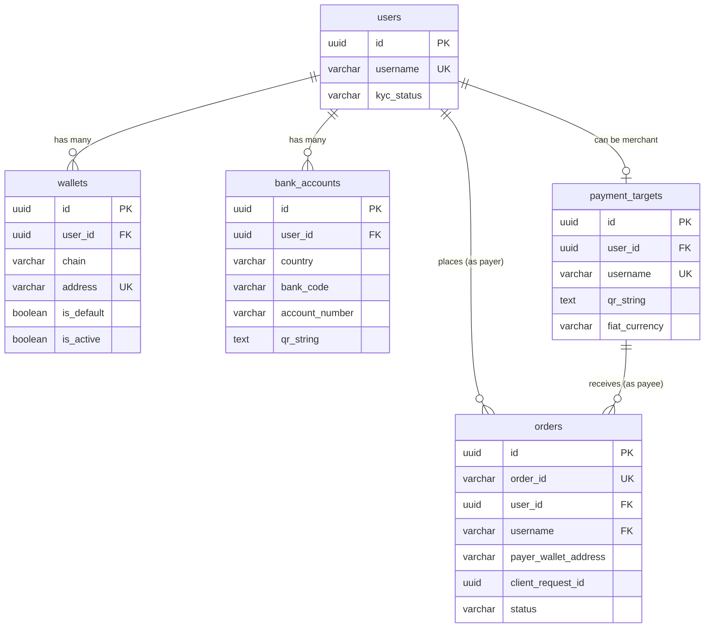

# Identity – Wallet – User QR Requirements


## 0. Bối cảnh & Mục tiêu


**Sản phẩm**: Payment Infrastructure


**Chain sử dụng**: SUI (mở rộng sau)


**Mục tiêu**:


- Xây dựng lớp identity theo `userID`
- Cho phép khôi phục identity bằng wallet
- Quản lý nhiều wallet + nhiều ngân hàng trên cùng một user
- Cung cấp QR theo user (username) để nhận tiền
- Quản lý default wallet và vòng đời wallet


---


## 1. Phạm vi


### 1.1 Trong phạm vi


- `userID` và `username`
- Liên kết wallet onchain
- Liên kết tài khoản ngân hàng offchain
- Default wallet
- User QR (QR theo username, resolve bằng default wallet)
- Deactivate wallet
- Xoá wallet (hard delete)


---


## 3. Nguyên tắc cốt lõi (bắt buộc)


1. **Wallet** (chain + address) là khoá mạnh nhất để restore identity
2. Nếu wallet đã tồn tại:
   - Hiển thị "wallet đã đăng ký dưới username X"
   - Cho phép dùng luôn
   - **Không tạo user mới**
3. **userID** là lõi duy nhất của identity
4. **username** là public alias, có thể đổi
5. **QR** là QR theo user, không theo wallet
6. **Default wallet** quyết định địa chỉ nhận tiền khi scan QR


---


## 4. Use Cases


### **UC1 – Create Identity** (wallet chưa tồn tại)


**Mô tả**: Tạo `userID` mới và gắn `username` do user đặt.


**Rule bắt buộc**:


- `username` phải unique (global)
- `userID` immutable, không lộ ra ngoài
- UC này chỉ chạy khi restore identity thất bại


---


### **UC2 – Link Wallet vào Identity**


**Mô tả**: Liên kết wallet onchain vào `userID`.


**Rule bắt buộc**:


- Mỗi wallet chỉ thuộc về một `userID` duy nhất
- Không cho relink wallet sang `userID` khác
- Link xong phải có trạng thái `active`


---


### **UC3 – Link Ngân hàng vào Identity**


**Mô tả**: Liên kết tài khoản ngân hàng offchain vào `userID`.


**Rule bắt buộc**:


- Mỗi tài khoản ngân hàng chỉ thuộc về một `userID`
- Không cho dùng chung ngân hàng giữa các `userID`
- Ngân hàng inactive thì không được set default


---


### **UC4 – Một userID sở hữu nhiều Account**


**Mô tả**: Một user có thể có nhiều wallet và nhiều ngân hàng.


**Rule bắt buộc**:


- Mọi account đều phải chứa `userID`
- Không tồn tại account "mồ côi" không có `userID`


---


### **UC5 – User QR** (QR theo username, resolve bằng default wallet)


**Mô tả**: QR public của user, khi quét hiển thị username và lấy địa chỉ nhận từ default wallet.


**Rule bắt buộc**:


- QR chỉ encode `username`, không encode địa chỉ ví
- Khi scan, hệ thống phải resolve: `username` → `userID` → default wallet
- Nếu chưa set default wallet → trả lỗi `DEFAULT_WALLET_NOT_SET`
- Nếu default wallet inactive → tự động fallback sang wallet active khác
- Nếu không có wallet active nào → block


---


### **UC6 – Chọn Default Wallet**


**Mô tả**: User chọn wallet dùng làm mặc định.


**Rule bắt buộc**:


- Tại mọi thời điểm chỉ có 1 default wallet
- Wallet inactive không được set default
- Nếu user chỉ có 1 wallet thì wallet đó auto default


---


### **UC7 – Deactivate Wallet hoặc Ngân hàng**


**Mô tả**: Ngưng sử dụng account nhưng giữ lịch sử.


**Rule bắt buộc**:


- Account inactive không được dùng cho receive hoặc pay
- Nếu deactivate account default → phải auto chọn default mới hoặc unset
- Không xoá record khỏi DB


---


### **UC8 – Đổi Username**


**Mô tả**: User đổi tên hiển thị.


**Rule bắt buộc**:


- `username` mới phải unique (global)
- QR user phải reflect `username` mới
- `userID` và các account không thay đổi


---


### **UC9 – Restore Identity** khi dùng lại wallet


**Mô tả**: Connect/import wallet đã tồn tại thì khôi phục identity.


**Rule bắt buộc**:


- Restore dựa trên `(chain + walletAddress)`
- Phải trả về `username` đã đăng ký
- **Không tạo `userID` mới** trong mọi trường hợp


---


### **UC10 – Onboarding Entrypoint** (AUTO)


**Mô tả**: Một entrypoint cho onboarding.


**Rule bắt buộc**:


- Luôn gọi UC9 trước
- Chỉ gọi UC1 khi UC9 không tìm thấy wallet
- Không cho skip bước restore


---


### **UC11 – Không tạo Identity trùng**


**Mô tả**: Đảm bảo hệ thống chỉ có một identity cho mỗi wallet.


**Rule bắt buộc**:


- Nếu wallet đã tồn tại → reject mọi attempt tạo `userID` mới
- Mọi app phải dùng chung logic restore


---


### **UC12 – Xoá Wallet khỏi Tài khoản**


**Mô tả**: Người dùng xoá hẳn một wallet khỏi account và xoá record trong DB.


**Rule bắt buộc**:


- Wallet bị xoá không được là wallet mặc định
- Nếu wallet là default → bắt buộc user đổi default trước
- Chỉ cho xoá wallet thuộc `userID` hiện tại
- Xoá là **hard delete** khỏi DB (không deactivate)
- Sau khi xoá: không còn restore identity bằng wallet đó nữa


---


### **UC13 – Khoá tạm Wallet** (SOFT LOCK)


**Mô tả**: Người dùng tạm khoá wallet mà không xoá.


**Rule bắt buộc**:


- Wallet bị khoá không được dùng receive/pay
- Wallet bị khoá không được set default
- Wallet khoá vẫn có thể mở lại
- Wallet khoá vẫn giữ khả năng restore identity


---


### **UC14 – KYC theo userID** (ONE-TIME KYC)


**Mô tả**: Người dùng phải KYC thì mới được phép chuyển tiền và chỉ cần KYC một lần cho toàn bộ identity.


**Rule bắt buộc**:


- KYC gắn với `userID`, không gắn với wallet
- User chưa KYC → block mọi hành vi chuyển tiền
- User KYC rồi → tất cả wallet và ngân hàng dùng chung KYC đó
- Không cần KYC lại khi thêm wallet mới


---


### **UC15 – Kế thừa KYC cho Wallet mới**


**Mô tả**: Khi user đã KYC, mọi wallet hoặc ngân hàng được link sau đó tự động kế thừa trạng thái KYC.


**Rule bắt buộc**:


- Wallet mới link không trigger KYC lại
- Trạng thái KYC luôn đọc từ `userID`
- Wallet không có KYC riêng


---


### **UC16 – Block Chuyển tiền nếu KYC chưa Approved**


**Mô tả**: Hệ thống chặn mọi hành vi chuyển tiền nếu KYC chưa đạt trạng thái approved.


**Rule bắt buộc**:


- Chưa KYC hoặc KYC pending → không cho transfer
- Chỉ cho phép các hành vi không tài chính (view, link wallet, set default)
- Message trả về phải rõ: `"KYC required to transfer"`


---


### **UC17 – Refresh KYC cho toàn bộ Identity**


**Mô tả**: Trong trường hợp cần re-KYC, toàn bộ identity bị ảnh hưởng cùng lúc.


**Rule bắt buộc**:


- Khi `userID` bị yêu cầu re-KYC → tất cả wallet bị block transfer
- Sau khi re-KYC xong → toàn bộ wallet mở lại
- Không có trạng thái KYC riêng theo wallet


---


### **UC18 – Hiển thị trạng thái KYC thống nhất**


**Mô tả**: Mọi app hiển thị một trạng thái KYC duy nhất cho user.


**Rule bắt buộc**:


- Trạng thái KYC luôn resolve từ `userID`
- Không có KYC theo app hay theo wallet
- UI phải phản ánh đúng trạng thái hiện tại


---


### **UC19 – Prevent KYC Bypass bằng Wallet mới**


**Mô tả**: Ngăn người dùng né KYC bằng cách thêm wallet khác.


**Rule bắt buộc**:


- Thêm wallet mới không bypass được KYC
- Nếu `userID` chưa KYC → wallet mới vẫn bị block transfer
- Logic check KYC luôn chạy trước transfer


---


## 5. Functional Requirements


### FR-1: Quản lý Identity


- **FR-1.1**: Tạo identity mới khi wallet chưa tồn tại (UC1)
- **FR-1.2**: Khôi phục identity bằng wallet (UC9)
- **FR-1.3**: Đổi username (UC8)
- **FR-1.4**: Onboarding entrypoint tự động restore trước khi tạo mới (UC10)


### FR-2: Quản lý Wallet


- **FR-2.1**: Liên kết wallet vào `userID` (UC2)
- **FR-2.2**: Chọn default wallet (UC6)
- **FR-2.3**: Deactivate wallet - soft lock (UC7, UC13)
- **FR-2.4**: Reactivate wallet - mở lại wallet bị khoá (UC13)
- **FR-2.5**: Xoá wallet - hard delete (UC12)
- **FR-2.6**: Liệt kê tất cả wallets của user (UC4)
- **FR-2.7**: Kiểm tra wallet đã tồn tại hay chưa (UC11)


### FR-3: Quản lý Ngân hàng


- **FR-3.1**: Liên kết tài khoản ngân hàng (UC3)
- **FR-3.2**: Deactivate ngân hàng (UC7)
- **FR-3.3**: Reactivate ngân hàng
- **FR-3.4**: Xoá ngân hàng (hard delete)
- **FR-3.5**: Chọn default bank account
- **FR-3.6**: Liệt kê tất cả bank accounts của user (UC4)


### FR-4: User QR


- **FR-4.1**: Sinh QR theo username (UC5)
- **FR-4.2**: Khi scan QR hiển thị username (UC5)
- **FR-4.3**: Resolve địa chỉ nhận từ default wallet (UC5)
- **FR-4.4**: Fallback sang wallet khác nếu default inactive (UC5)


### FR-5: KYC Management


- **FR-5.1**: Submit KYC cho userID (UC14)
- **FR-5.2**: Kiểm tra trạng thái KYC (UC14, UC18)
- **FR-5.3**: Block transfer nếu KYC chưa approved (UC16)
- **FR-5.4**: Kế thừa KYC cho wallet mới (UC15)
- **FR-5.5**: Re-KYC cho toàn bộ identity (UC17)
- **FR-5.6**: Prevent KYC bypass (UC19)


---


## 6. Rules bắt buộc


### 6.1 Uniqueness


- Wallet unique theo `(chain, address)`
- Username unique (global)
- Ngân hàng unique theo `(country, bankCode, accountNumber)`


### 6.2 Default Wallet


- Mỗi user có tối đa **1 default wallet**
- Không cho set wallet inactive làm default
- Không cho xoá wallet default
- Nếu default wallet bị deactivate → fallback sang wallet active khác hoặc block


### 6.3 Xoá Wallet


- Chỉ cho xoá wallet thuộc `userID` hiện tại
- Wallet default không được xoá
- Xoá là **hard delete** khỏi DB
- Wallet đã xoá không thể restore identity bằng wallet đó


---


## 7. Database Schema


### Overview


The unified schema supports:


- **Identity management**: users, wallets, bank accounts
- **Payment processing**: payment targets, orders


All tables use **PostgreSQL** with UUID primary keys and proper foreign key constraints.


---


### Table: `users`


Core identity table for all users.


```sql
CREATE TABLE users (
    id                  UUID PRIMARY KEY DEFAULT gen_random_uuid(),
    username            VARCHAR(255) UNIQUE NOT NULL,
    kyc_status          VARCHAR(50), -- 'pending' | 'approved' | 'rejected'
    kyc_submitted_at    TIMESTAMP,
    kyc_approved_at     TIMESTAMP,
    created_at          TIMESTAMP DEFAULT NOW(),
    updated_at          TIMESTAMP DEFAULT NOW()
);


CREATE INDEX idx_users_username ON users(username);
CREATE INDEX idx_users_env ON users(env);
```


**Purpose**: Central identity for each user across the system.


**Key fields**:


- `username`: Public alias, globally unique
- `kyc_status`: KYC state (managed by Gaian integration)


---


### Table: `wallets`


Onchain wallets linked to users.


```sql
CREATE TABLE wallets (
    id              UUID PRIMARY KEY DEFAULT gen_random_uuid(),
    user_id         UUID NOT NULL REFERENCES users(id) ON DELETE CASCADE,
    chain           VARCHAR(50) NOT NULL, -- 'Sui'
    address         VARCHAR(255) NOT NULL,
    is_default      BOOLEAN DEFAULT FALSE,
    is_active       BOOLEAN DEFAULT TRUE,
    created_at      TIMESTAMP DEFAULT NOW(),
    updated_at      TIMESTAMP DEFAULT NOW(),


    CONSTRAINT unique_wallet UNIQUE(chain, address)
);


CREATE INDEX idx_wallets_user_id ON wallets(user_id);
CREATE INDEX idx_wallets_address ON wallets(address);
```


**Purpose**: Store Sui wallet addresses for identity restoration and payment attribution.


**Key constraints**:


- One wallet can only belong to one user (globally unique)
- Only one wallet can be `is_default = true` per user (enforced by application logic)


---


### Table: `bank_accounts`


Offchain bank accounts linked to users.


```sql
CREATE TABLE bank_accounts (
    id              UUID PRIMARY KEY DEFAULT gen_random_uuid(),
    user_id         UUID NOT NULL REFERENCES users(id) ON DELETE CASCADE,
    country         VARCHAR(10) NOT NULL, -- 'VN' | 'PH'
    bank_code       VARCHAR(50) NOT NULL,
    account_number  VARCHAR(100) NOT NULL,
    account_name    VARCHAR(255),
    qr_string       TEXT, -- Bank QR data for receiving payments
    is_default      BOOLEAN DEFAULT FALSE,
    is_active       BOOLEAN DEFAULT TRUE,
    created_at      TIMESTAMP DEFAULT NOW(),
    updated_at      TIMESTAMP DEFAULT NOW(),


    CONSTRAINT unique_bank_account UNIQUE(country, bank_code, account_number)
);


CREATE INDEX idx_bank_accounts_user_id ON bank_accounts(user_id);
```


**Purpose**: Store bank account details for receiving fiat payouts.


**Key fields**:


- `qr_string`: Bank QR data used for Gaian prefunded payments
- One bank account per `(country, bank_code, account_number)` combination


---


### Table: `payment_targets`


Mapping of payment receiver config by `username` (for merchants receiving payments).


```sql
CREATE TABLE payment_targets (
    id              UUID PRIMARY KEY DEFAULT gen_random_uuid(),
    user_id         UUID NOT NULL REFERENCES users(id) ON DELETE CASCADE,
    username        VARCHAR(255) UNIQUE NOT NULL, -- Same as users.username
    qr_string       TEXT NOT NULL, -- Bank QR for Gaian prefund
    fiat_currency   VARCHAR(10) NOT NULL, -- 'VND' | 'PHP'
    is_active       BOOLEAN DEFAULT TRUE,
    display_name    VARCHAR(255),
    merchant_name   VARCHAR(255),
    country         VARCHAR(10),
    notes           TEXT,
    created_at      TIMESTAMP DEFAULT NOW(),
    updated_at      TIMESTAMP DEFAULT NOW()
);


CREATE INDEX idx_payment_targets_username ON payment_targets(username);
CREATE INDEX idx_payment_targets_user_id ON payment_targets(user_id);
```


**Purpose**: Store merchant configuration for receiving payments via Gaian prefunded flow.


**Key fields**:


- `qr_string`: Bank QR data loaded when frontend submits username
- `fiat_currency`: Default currency for this merchant
- Typically there's a 1:1 relationship between `users` and `payment_targets` for merchants


---


### Table: `orders`


Local mirror of Gaian order lifecycle.


```sql
CREATE TABLE orders (
    id                          UUID PRIMARY KEY DEFAULT gen_random_uuid(),
    order_id                    VARCHAR(255) UNIQUE NOT NULL, -- Gaian order ID
    user_id                     UUID REFERENCES users(id), -- Payer user
    username                    VARCHAR(255) REFERENCES payment_targets(username), -- Payee
    payer_wallet_address        VARCHAR(255) NOT NULL, -- Sui wallet address
    client_request_id           UUID, -- Idempotency key from frontend
    status                      VARCHAR(50) NOT NULL, -- 'processing' | 'completed' | 'failed'
    fiat_amount                 DECIMAL(20, 2) NOT NULL,
    fiat_currency               VARCHAR(10) NOT NULL, -- 'VND' | 'PHP'
    crypto_amount               DECIMAL(30, 10),
    crypto_currency             VARCHAR(10), -- 'USDC' | 'USDT'
    chain                       VARCHAR(50), -- 'Sui'
    exchange_rate               DECIMAL(20, 6),
    bank_transfer_status        VARCHAR(50),
    bank_transaction_reference  JSONB,
    expires_at                  TIMESTAMP,
    poll_count                  INTEGER DEFAULT 0,
    last_checked_at             TIMESTAMP,
    gaian_raw                   JSONB, -- Full Gaian response for audit
    created_at                  TIMESTAMP DEFAULT NOW(),
    updated_at                  TIMESTAMP DEFAULT NOW(),


    CONSTRAINT unique_client_request UNIQUE(payer_wallet_address, client_request_id)
);


CREATE INDEX idx_orders_order_id ON orders(order_id);
CREATE INDEX idx_orders_user_id ON orders(user_id);
CREATE INDEX idx_orders_payer_wallet ON orders(payer_wallet_address);
CREATE INDEX idx_orders_username ON orders(username);
CREATE INDEX idx_orders_status ON orders(status);
CREATE INDEX idx_orders_created_at ON orders(created_at);
```


**Purpose**: Track all payment orders and their lifecycle.


**Key fields**:


- `order_id`: Unique order ID from Gaian
- `user_id`: Payer (nullable if user not registered)
- `username`: Merchant receiving payment
- `payer_wallet_address`: For attribution when user is not registered
- `client_request_id`: Idempotency key to prevent duplicate orders
- `gaian_raw`: Store full Gaian response for debugging and audit


**Idempotency**:


- Unique constraint on `(payer_wallet_address, client_request_id)` prevents duplicate orders


---


### Entity Relationships





**Relationship summary**:


- `users` (1) ──< (N) `wallets`
- `users` (1) ──< (N) `bank_accounts`
- `users` (1) ──< (0..1) `payment_targets` (only for merchants)
- `users` (1) ──< (N) `orders` (as payer)
- `payment_targets` (1) ──< (N) `orders` (as payee)


---


## 8. API Endpoints (service của mình)


| Method   | Endpoint           | Mô tả                        |
| -------- | ------------------ | ---------------------------- |
| `POST`   | `/onboarding`      | Onboarding entrypoint (UC10) |
| `POST`   | `/users/username`  | Đổi username (UC8)           |
| `POST`   | `/wallets/link`    | Link wallet vào userID (UC2) |
| `POST`   | `/wallets/default` | Chọn default wallet (UC6)    |
| `DELETE` | `/wallets/{id}`    | Xoá wallet (UC12)            |
| `POST`   | `/banks/link`      | Link ngân hàng (UC3)         |
| `GET`    | `/qr/{username}`   | Lấy QR của user (UC5)        |


---


## 9. Error Codes


| Error Code                     | Mô tả                                  |
| ------------------------------ | -------------------------------------- |
| `USERNAME_ALREADY_TAKEN`       | Username đã được sử dụng               |
| `WALLET_ALREADY_LINKED`        | Wallet đã được link vào userID khác    |
| `BANK_ALREADY_LINKED`          | Ngân hàng đã được link vào userID khác |
| `DEFAULT_WALLET_NOT_SET`       | User chưa set default wallet           |
| `CANNOT_DELETE_DEFAULT_WALLET` | Không thể xoá wallet default           |
| `ACCOUNT_NOT_OWNED`            | Account không thuộc về user hiện tại   |
| `INVALID_INPUT`                | Input không hợp lệ                     |
| `KYC_REQUIRED`                 | Yêu cầu KYC trước khi transfer         |


---


## 10. Tech Stack (đề xuất)


### Backend


- **Language**: TypeScript
- **Framework**: NestJS hoặc Express
- **Architecture**: Monolith
- **ORM**: Prisma hoặc TypeORM


### Database


- **PostgreSQL**
- UUID primary key
- Unique constraint + transaction


### Blockchain


- **Chain**: SUI
- **Wallet connect**: Fystack
- **Address validation**: SUI SDK


### Storage


- Object storage (S3 compatible) cho QR image
- Redis (optional) cho cache restore identity


### Infrastructure


- Environment separation: sandbox / mainnet
- Secrets: env variables
- Logging + audit trail


---


## 11. Acceptance Criteria


✅ Dùng lại wallet ở app khác → hiện username cũ và dùng luôn


✅ Scan QR → thấy username và resolve đúng default wallet


✅ Wallet default không xoá được


✅ Wallet xoá rồi không restore identity được


✅ Một `userID` có thể sở hữu nhiều wallet và ngân hàng


✅ KYC một lần cho toàn bộ identity, không cần KYC lại khi thêm wallet


✅ User chưa KYC không thể transfer


---


## 12. Flow Diagrams


### Onboarding Flow


```
User connects wallet
       ↓
Check if wallet exists (UC9)
       ↓
    ┌──────┴──────┐
    ↓             ↓
  Found       Not found
    ↓             ↓
Restore    Create new identity (UC1)
identity        ↓
    ↓      Set username
    └──────┬──────┘
           ↓
    Link wallet (UC2)
           ↓
      Success
```


### Payment QR Flow


```
User generates QR (UC5)
       ↓
Encode username in QR
       ↓
Payer scans QR
       ↓
Resolve username → userID → default wallet
       ↓
Return wallet address for payment
```


### Wallet Management Flow


```
User has multiple wallets
       ↓
Choose one as default (UC6)
       ↓
  ┌────┴────┐
  ↓         ↓
Keep    Deactivate (UC7)
active   or Delete (UC12)
  ↓         ↓
 Pay     Cannot use
           for payment
```


